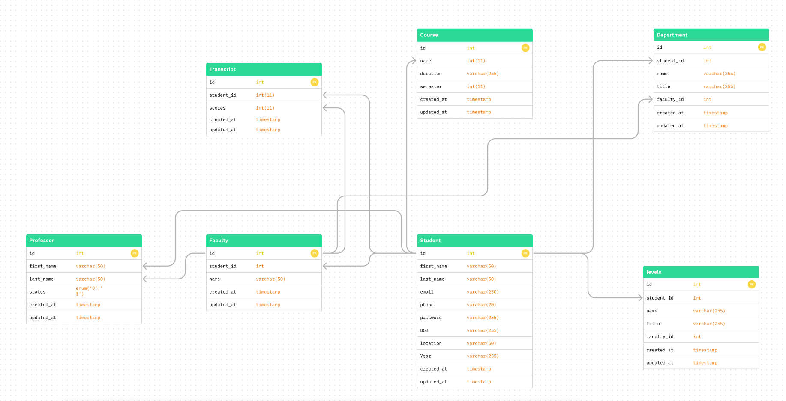

1.1 STATEMENT OF PROBLEM
 
Nowadays, in the academic system it is still observed that quite a few numbers of management in the institutions are not using electronic devices as a means of records
keeping for their student’s information. They still adopt the old system; paper works
 can be destroyed or lost important documents require proper attention.
Also, as admission is being taking place in schools collection of every student’s details is time consuming on the basis of fact that only one or few staff are attending to more thanthousands of students at a time when registering and this consumes the energy and time.
There can even be loss of one particular document of which it doesn’t provide a secure
mode of operations by the management.All these can be solved by the use of designed programs that are meant to handles those problems and to provide genuine and ensure that peoples information are properly managed

 

1.2 AIM AND OBJECTIVES

The aim of this study is to design and implement an automated transcript managementsystem for the university of Dschang. The following objectives willbe used to achieve this aim:
 
1. Collection of information about the old system by searching library and observing.

 
2. The problem of the old system which is delay in getting result and loss of studentdata.

 
3. To solve this problem design a new system that will be more adequate and more efficient.

 
3. Implement the new system using nodejs mvc framwork(adonisjs) as a server, Mysql for database, HTML and CSS for frontend and Heroku for deployment

This project aims to presenting a simple and fast method of preparing student transcript over the internet without fraud. Its serves the users of the system in plain and simple language with quick computation delivery of result for action to be taken.The application will help reduce stress and speed up rate at which records are prepared it will also yield good communication between students and the general public through feedback, forms, emails etc

1.3 DATABASE DESIGN

Here is our databse schema

[Full link to dbms schema!](https://www.figma.com/file/SYcfFLgk2JoO3xOmBzsRqK/Canwe-database-uml-(Community)?node-id=0%3A1)

1.4 SYSTEM DESIGN AND SYSTEM IMPLEMENTATION

Application Routes

Here is some of the endpoints we are going to be implementing for our endpoint

| URL     | METHOD      | FUNCTION     |
| ------------- | ------------- | -------- |
| /register         | POST         | To register a new Student/Staff  |
| /login           | POST         | to login an existing staff  |
 /dashboard         | GET         | gets staff into the dasbaord  |
| /transcript           | POST         | to generate a new transcript  |
| /transcript/student/{student_id}          | GET        | to fetch all transcript for a particular student  |
| /transcript/student/{student_id}/{transcript_id}       | GET        | To fetch a certain transcript
| /transcript/send         | POST         | To send transcript to a Student/Staff email |
| /course         | GET        | get all courses|
| /faculty         | GET        | get all faculties|
| /department         | GET        | get all departments|
| /professor         | GET        | get all professors|
| /students         | GET        | get all students|

more endpoints to be added....

 CONCLUSION
 
 In this project, a transcript management system was developed that facilitates the various activities taking places at school exam and records mainly for easily access,reduce stress of applying for transcript and also to secure some data. It is flexible as changes can easily be accommodated and take effect immediately